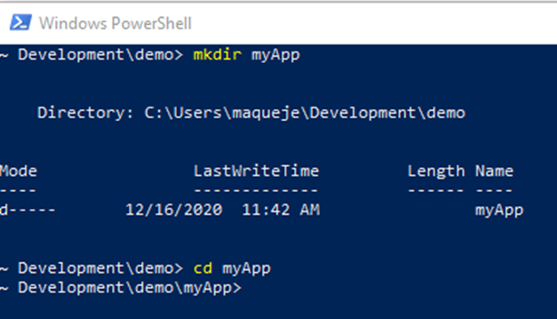
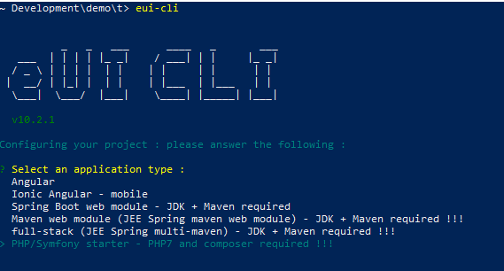
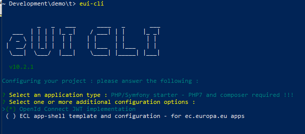
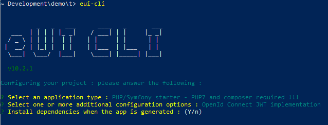
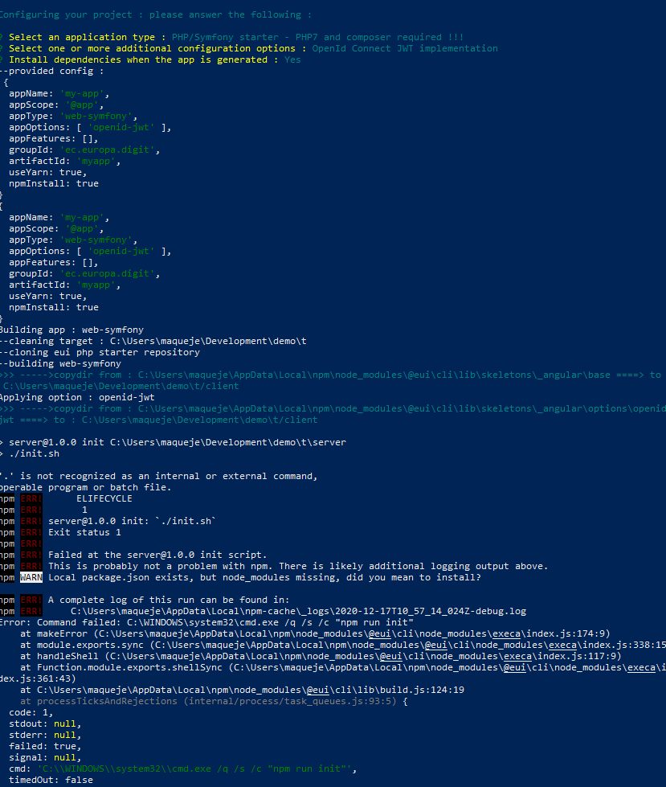

 Building the application
==========================

DIGIT has create a CLI for generating the skeleton of an SPA frontend using eUI. The CLI offers the option of adding into the skeleton the backend part

## Installing the necessary tools

Before going further, we need to insure that the developer environment is having the necessary software.

***You will have to check the installation approach based on your environment (OS, network)***

### NodeJS

The version needed is the 10.x.

For managing the NodeJS version, we recommend is usage. If will allow you to install multiple NodeJS version and switch between the different version.

You can find NVM on github: <https://github.com/nvm-sh/nvm>

Several internet site explain how to install it over the different existing OS (Linux, OSX and Windows).

Below some site explaining how to install:

<https://heynode.com/tutorial/install-nodejs-locally-nvm>

<https://docs.microsoft.com/en-us/windows/nodejs/setup-on-windows>

```bash
nvm install 10.23.0
```

### NPM

You will need also to have NPM for installing packages. Which is installed along with NodeJs : <https://www.npmjs.com/get-npm>

### YARN

Yarn is another package manager.

<https://yarnpkg.com/getting-started/install>

```bash
npm install -g yarn
```

### eUI-CLI

You install the eUI Cli using NPM (or Yarn). The package is located here:

<https://www.npmjs.com/package/@eui/cli>

```bash
npm install -g @eui/cli@latest
```

### Symfony CLI

You can install also the Symfony CLI. The installed is located: <https://symfony.com/download>

The CLI is not mandatory but provide useful tools / shortcut to the command.

### Composer

You have to install Composer: <https://getcomposer.org/download/>

### GIT

You have to install GIT (which comes with Git-Bash): <https://git-scm.com/downloads>

Eventually, you can install a GUI: <https://git-scm.com/downloads/guis>

### PHP 7.X

You will also need PHP installed: <https://www.php.net/manual/en/install.windows.php>

## Initialise the applications with eUI CLI

You need to open a command line. As being under windows, launch a PowerShell terminal.


We are creating a folder where we will create the SPA. We will execute the eUI CLI from that folder.

```bash
cd <your-root-dev-folder>
mkdir myApp
cd myApp
eui-cli
```



The eUI CLI is an interactive systematci tool.

It will let you choose your installation flavour.



In our case, we are selecting: **PHP/Symfony Starter - PHP6 and composer required !!!**

The next step is for selecting options, we are selecting: **OpenId Connect JWT implementation**



And just accept the dependencies installation



From there, the eUI CLIT will creates the folders: one for the front (client) and one for the backoffice (server).

***Under windows, the eUI CLI script will fail when trying to execute a post clone script which is written in bash script (init.sh)***



The [init.sh](server/init.sh) is very simple.

```bash
#!/bin/bash

echo 'Checking PHP prerequisites ...'

check_cmd() {
  $1 --version > /dev/null 2>&1
  OUT=$?
  if [[ $OUT -ne 0 ]]; then
      echo "$1 command not found."
  else
      echo "$1 command found."
  fi
  return $OUT
}

if check_cmd "php"; then
  if check_cmd "composer"; then
    echo "Building Symfony application ..."
  else
    echo "ERROR: Symfony application cannot be built."
    exit 1
  fi
else
  echo "ERROR: Symfony application cannot be built."
  exit 1
fi

cd "$(dirname "$0")"
composer create-project symfony/skeleton app
cd app
composer req api annotations
composer req maker --dev
```

You can run manually the composer commands as in the last line of the [init.sh](server/init.sh)

You need also to add the following package for securing the back office using EU Login

```bash
composer req ecphp/eu-login-bundle
```

You  can add other package such:

```bash
composer req --dev doctrine/doctrine-fixtures-bundle
composer req --dev symfony/web-profiler-bundle
```
