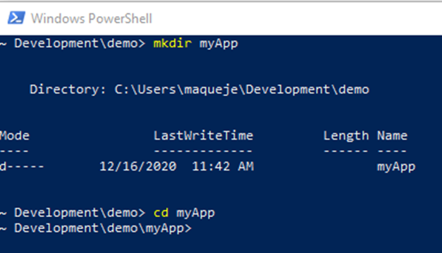
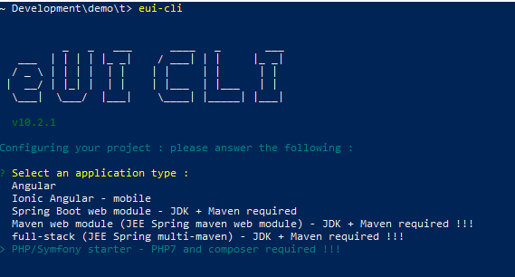

Initialise the applications with eUI CLI
========================================

You need to open a command line. As being under windows, launch a PowerShell terminal.


We are creating a folder where we will create the SPA. We will execute the eUI CLI from that folder.

## Create the folder structure

```bash
cd <your-root-dev-folder>
mkdir myApp
cd myApp
eui-cli
```



## Launch the eUI CLI

```bash
cd <your-root-dev-folder>
cd myApp
eui-cli
```

The eUI CLI is an interactive systematic tool.

It will let you choose your installation flavour.



In our case, we are selecting: **PHP/Symfony Starter - PHP6 and composer required !!!**

The next step is for selecting options, we are selecting: **OpenId Connect JWT implementation**


And just accept the dependencies installation


From there, the eUI CLIT will creates the folders: one for the front (client) and one for the backoffice (server).

***Under windows, the eUI CLI script will fail when trying to execute a post clone script of the backend (symfony) which is written in bash script (init.sh)***

## Under Windows issue

the eUI CLI script will fail when trying to execute a post clone script of the backend (symfony) which is written in bash script (init.sh). Under windows, CMD or PowerShell script can be run natively.


The [init.sh](https://github.com/MaquestiauxTraining/spa-0-100-eui/blob/main/server/init.sh) is very simple.

```bash
#!/bin/bash

echo 'Checking PHP prerequisites ...'

check_cmd() {
  $1 --version > /dev/null 2>&1
  OUT=$?
  if [[ $OUT -ne 0 ]]; then
      echo "$1 command not found."
  else
      echo "$1 command found."
  fi
  return $OUT
}

if check_cmd "php"; then
  if check_cmd "composer"; then
    echo "Building Symfony application ..."
  else
    echo "ERROR: Symfony application cannot be built."
    exit 1
  fi
else
  echo "ERROR: Symfony application cannot be built."
  exit 1
fi

cd "$(dirname "$0")"
composer create-project symfony/skeleton app
cd app
composer req api annotations
composer req maker --dev
```

You can run manually the composer commands as in the last line of the [init.sh](https://github.com/MaquestiauxTraining/spa-0-100-eui/blob/main/server/init.sh)

## Extra features to install

You need also to add the following package for securing the back office using EU Login

```bash
composer req ecphp/eu-login-bundle
```

You  can add other package such:

```bash
composer req --dev doctrine/doctrine-fixtures-bundle
composer req --dev symfony/web-profiler-bundle
```
